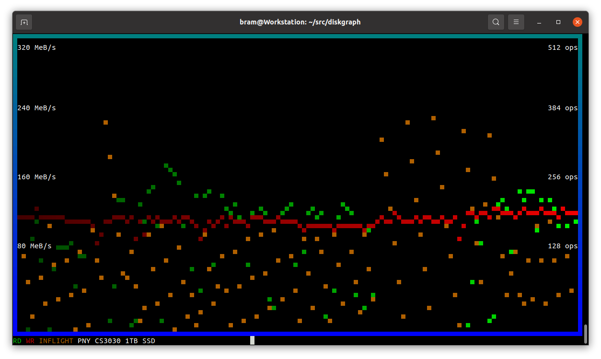

# diskgraph
Monitor for disk IO

## Introduction

The diskgraph tool will graph disk IO under linux, in a terminal.

Examples:

**$ ./diskgraph nvme0n1**

**$ ./diskgraph sda**

Periodically (500ms intervals) it will read the statistics from /sys/block/DEVICE/stat and see how many sectors are read and written since last sample.

These are converted to bandwidth, by dividing by time.

It also shows (in orange) the number of operations that are in-flight at the moment the sample was taken.

## Keys

Press ESCAPE to stop diskgraph.

## Known issues

* Missing manual page.
* Assumes 512 byte sectors.
* If sleep interval is not exact, the BW computation will be off.

## Copyright

diskgraph is (c)2021 by Bram Stolk and licensed under the MIT license.

